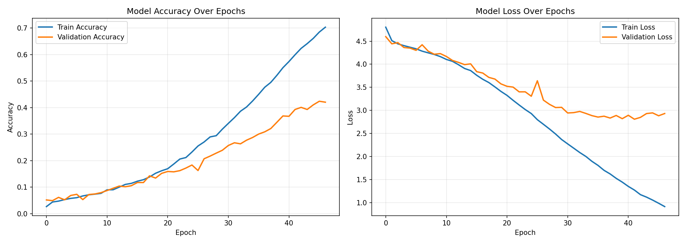
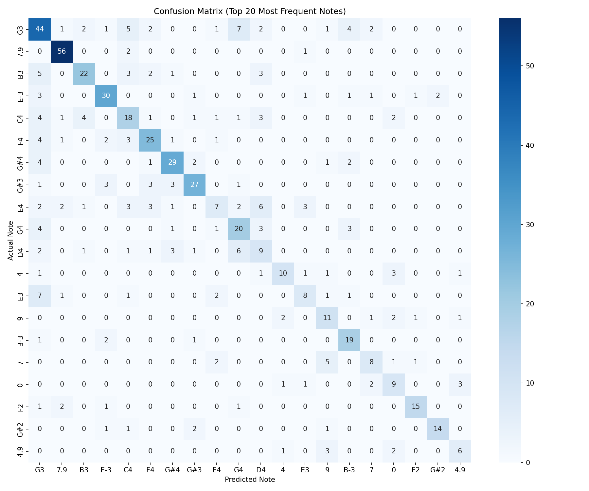

# AI Classical Piano Music Generator

An LSTM-based neural network that generates original classical piano music by learning patterns from MIDI files.

## Team Members
- Firas Georges
- Moshe Amar
- Alexander Akyian
- Juan Martinez
- Jose Hernandez

## Project Overview

**Objective:** Generate original classical piano music using a Recurrent Neural Network (RNN).

**Problem:** Music composition is a complex creative task that involves long-term structure and harmony. We are attempting to see if an AI can learn these patterns from MIDI data.

**Solution:** A stacked LSTM (Long Short-Term Memory) network trained on classical piano MIDI files.

## Sample Output

Listen to our AI-generated music:
- [Sample 1](sample_result_1.mid)
- [Sample 2](sample_result_2.mid)
- [Sample 3](sample_result_3.mid)

## Technologies Used

| Technology | Purpose |
|------------|---------|
| Python 3.x | Programming language |
| TensorFlow/Keras | Deep learning framework |
| Music21 | MIDI processing |
| NumPy | Numerical operations |
| Matplotlib/Seaborn | Visualization |
| Google Colab | Training environment |

## Model Architecture

- **3 Stacked LSTM layers** (512 units each)
- **Dropout layers** (0.3) for regularization
- **Dense output layer** with softmax activation
- **Temperature sampling** for creative variation
- **~5 million trainable parameters**

## How to Run

### Option 1: Google Colab (Recommended)

1. Open the notebook in Google Colab using the link below
2. Enable GPU: Runtime → Change runtime type → GPU
3. Download the dataset from Kaggle: https://www.kaggle.com/datasets/soumikrakshit/classical-music-midi/data
4. Run all cells in order
5. Upload the Kaggle zip file when prompted

### Option 2: Local Setup

1. Clone the repository: git clone https://github.com/F-Georges/AI-Classical-Piano-Music-Generator.git
2. Navigate to folder: cd AI-Classical-Piano-Music-Generator
3. Install dependencies: pip install -r requirements.txt
4. Run the notebook: jupyter notebook AI_Classical_Piano_Music.ipynb

## Dataset

| Property | Value |
|----------|-------|
| Source | Kaggle - Classical Music MIDI |
| Size | ~300 MIDI files |
| Composers | Various classical composers |
| Format | MIDI (.mid) |

Dataset Link: https://www.kaggle.com/datasets/soumikrakshit/classical-music-midi/data

##  How to Play MIDI Files

The generated .mid files can be played using:
- Online: Signal MIDI Player (https://signal.vercel.app/edit) or (https://cifkao.github.io/html-midi-player/)
- Windows: Windows Media Player, VLC (https://www.videolan.org/)
- Mac: GarageBand, QuickTime
- Mobile: Various MIDI player apps

## Dependencies

- music21>=7.0.0
- tensorflow>=2.10.0
- numpy>=1.21.0
- matplotlib>=3.5.0
- seaborn>=0.11.0
- scikit-learn>=1.0.0
- tqdm>=4.62.0

Install all dependencies with: pip install -r requirements.txt

## Results

### Evaluation Metrics

| Metric | Score |
|--------|-------|
| Accuracy | 32.27% |
| Precision | 33.04% |
| Recall | 32.27% |
| F1 Score | 31.42% |

**Note:** ~32% accuracy is significant given a vocabulary of 300-500 unique notes/chords. Random guessing would yield less than 1% accuracy.

### Training Progress

### Confusion Matrix (Top 20 Notes)

## Training Configuration

| Parameter | Value |
|-----------|-------|
| Epochs | 50 (with early stopping) |
| Batch Size | 64 |
| Optimizer | RMSprop |
| Loss Function | Categorical Cross-Entropy |
| Train/Test Split | 80% / 20% |
| Early Stopping | Patience = 5 |
| Sequence Length | 100 notes |
| Hardware | Google Colab GPU |
| Training Time | ~1-3 hours |

## License

This project is for educational purposes as part of our Introduction to AI course.

## Acknowledgments

- Kaggle for the Classical Music MIDI dataset
- Music21 library for MIDI processing
- Course instructors for guidance and support
